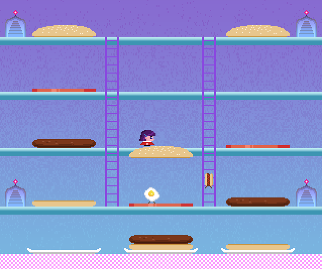

Burger Girl
===========
This is my remake of the classic arcade game BurgerTime. Stomp the
burger components down to the plates before you're killed by a hot
dog or an egg. It's written in C for Linux, and uses the SDL library
for graphics output. All art made by [Ida Pruitt](https://www.idapruitt.com).

